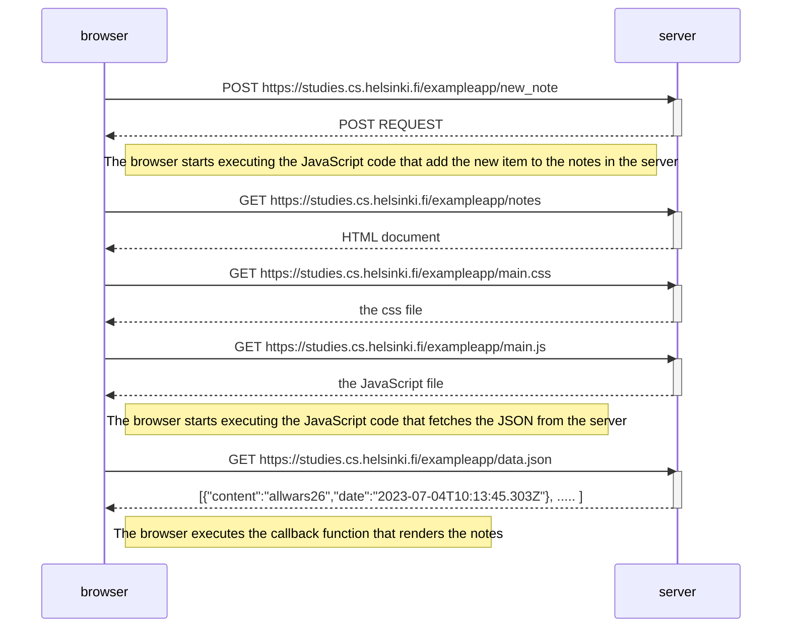

# 0.4: New note diagram

## A situation where a user creates a new note on the page https://studies.cs.helsinki.fi/exampleapp/notes .

```mermaid
sequenceDiagram
    participant browser
    participant server

    browser->>server: POST https://studies.cs.helsinki.fi/exampleapp/new_note
    activate server
    server-->>browser: POST REQUEST
    deactivate server

    Note right of browser: The browser starts executing the JavaScript code that add the new item to the notes in the server

    browser->>server: GET https://studies.cs.helsinki.fi/exampleapp/notes
    activate server
    server-->>browser: HTML document
    deactivate server

    browser->>server: GET https://studies.cs.helsinki.fi/exampleapp/main.css
    activate server
    server-->>browser: the css file
    deactivate server

    browser->>server: GET https://studies.cs.helsinki.fi/exampleapp/main.js
    activate server
    server-->>browser: the JavaScript file
    deactivate server

    Note right of browser: The browser starts executing the JavaScript code that fetches the JSON from the server

    browser->>server: GET https://studies.cs.helsinki.fi/exampleapp/data.json
    activate server
    server-->>browser: [{"content":"allwars26","date":"2023-07-04T10:13:45.303Z"}, ..... ]
    deactivate server

    Note right of browser: The browser executes the callback function that renders the notes
```
